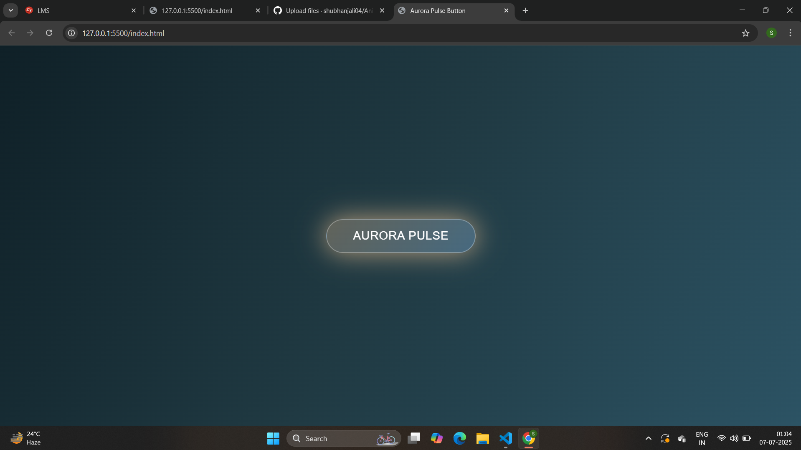

# 🌟 Week 5 Internship Task | CSI 25 Internship  

## ✨ Creative Project: Animated Aesthetic Floating Button  

Welcome to my **Week 5 CSI Internship** task!  
In this project, I have designed an **aesthetic, animated floating button** using **HTML** and **CSS** that adds an elegant, modern touch to web pages.

---

## 🚀 Project Highlights:
- Smooth floating & glowing animation  
- Beautiful gradient background  
- Neumorphic shadow effects for depth  
- Clean, responsive, and customizable design  

---

## 🛠️ Technologies Used:
- **HTML5**  
- **CSS3** (Animations, Gradients, Shadows)
- **Javascript**

---

## 📸 Output Preview:

---

## 🔗 Live Demo:
[Click here to view the live project](https://shubhanjali04.github.io/Animation-Button_CSIweek5/)

---

## 🙏 Acknowledgement:
I, **Shubhanjali Pandey**, have developed this project as part of **CSI 25 Internship Week 5** task.  
Special thanks to **Celebal Technologies** and **CSI 25 Internship Program** for this great learning opportunity.

